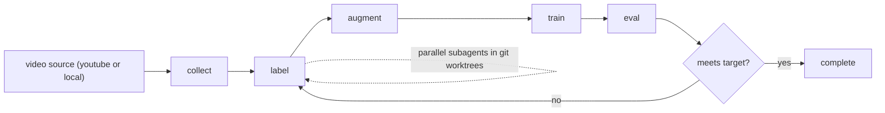

<h1 align="center">yolodex</h1>

<div align="center">


</div>

<div align="center">

codex-native yolo dataset + training agent skills for gameplay videos.

</div>

[](https://star-history.com/#qtzx06/yolodex&Date)

## architecture



## components

- skills runtime: [codex skills](https://developers.openai.com/codex/skills/)
- pipeline skills: `collect`, `label`, `augment`, `train`, `eval`, `yolodex`
- orchestration loop: `yolodex.sh` + `AGENTS.md`
- shared helpers: `shared/utils.py`

## installation

```bash
git clone https://github.com/qtzx06/yolodex && cd yolodex
bash setup.sh
bash yolodex-doctor.sh
```

requirements:
- macos or linux
- python 3.11+
- [codex cli](https://github.com/openai/codex)

## codex workflow (main path)

1. start codex in repo root
2. use the `yolodex` skill to gather config
3. run labeling with subagents when needed
4. iterate until eval target is met (fails fast on repeated errors)

example:

```text
$ codex
> use the yolodex skill to train from this video: https://youtube.com/...
> classes: player, weapon, vehicle
> label_mode: codex
> call subagent label frames with 4 agents
```

subagent dispatch command:

```bash
bash .agents/skills/label/scripts/dispatch.sh 4
```

## run modes

autonomous loop:

```bash
bash yolodex-run.sh
# optional override:
bash yolodex-run.sh 20
```

manual skills:

```bash
uv run .agents/skills/collect/scripts/run.py
bash .agents/skills/label/scripts/dispatch.sh 4
uv run .agents/skills/augment/scripts/run.py
uv run .agents/skills/train/scripts/run.py
uv run .agents/skills/eval/scripts/run.py
```

## config

minimal `config.json`:

```json
{
  "project": "my-project",
  "video_url": "https://youtube.com/watch?v=YOUR_VIDEO",
  "classes": ["player", "weapon", "vehicle"],
  "label_mode": "codex",
  "target_accuracy": 0.75,
  "num_agents": 4,
  "fps": 1,
  "yolo_model": "yolov8n.pt",
  "epochs": 50,
  "train_split": 0.8,
  "seed": 42
}
```

key fields:

| field | default | description |
|---|---|---|
| `project` | `""` | output namespace under `runs/<project>/` |
| `video_url` | `""` | youtube url or local video path |
| `classes` | `[]` | target classes |
| `label_mode` | `"codex"` | label strategy |
| `target_accuracy` | `0.75` | mAP@50 stop threshold |
| `num_agents` | `4` | parallel label workers |
| `fps` | `1` | extraction fps |
| `yolo_model` | `"yolov8n.pt"` | base yolo checkpoint |
| `epochs` | `50` | train epochs |
| `train_split` | `0.8` | train/val split |
| `seed` | `42` | deterministic split seed |

## outputs

- eval: `runs/<project>/eval_results.json`
- frames: `runs/<project>/frames/`
- label previews: `runs/<project>/frames/preview/`
- trained weights: `runs/<project>/weights/best.pt`
- live phase status: `runs/<project>/job_state.json`
- run metadata: `runs/<project>/run_manifest.json`
- label quality report: `runs/<project>/label_qa_report.json`
- timeline log: `progress.txt` (auto-appended per phase)
- quick status command: `bash yolodex-status.sh` (or `bash yolodex-status.sh --json`)
  - includes computed `next_action` with recommended command
- one-shot operator command: `bash yolodex-run.sh`

## repo layout

```text
yolodex/
├── .agents/skills/
│   ├── yolodex/
│   ├── collect/
│   ├── label/
│   ├── augment/
│   ├── train/
│   └── eval/
├── shared/utils.py
├── pipeline/main.py
├── docs/
├── yolodex.sh
├── setup.sh
├── AGENTS.md
├── config.json
├── progress.txt
└── pyproject.toml
```

## docs

- [docs/usage.md](docs/usage.md)
- [docs/models.md](docs/models.md)
- [docs/skills.md](docs/skills.md)
- [docs/architecture.md](docs/architecture.md)
- [docs/changelog.md](docs/changelog.md)

## contributing

contributions are welcome.

standard flow:

1. fork the repo and create a branch from `main`
2. keep changes scoped and explain the why in your pr
3. run relevant checks before opening the pr
4. open a pull request with:
   - clear summary
   - test/validation notes
   - screenshots/log snippets when relevant

if you’re planning a bigger change, open an issue first so we can align on direction.

## license

mit

made with love at openai <3
